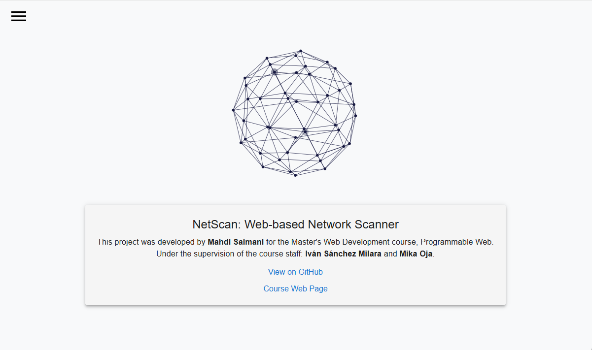
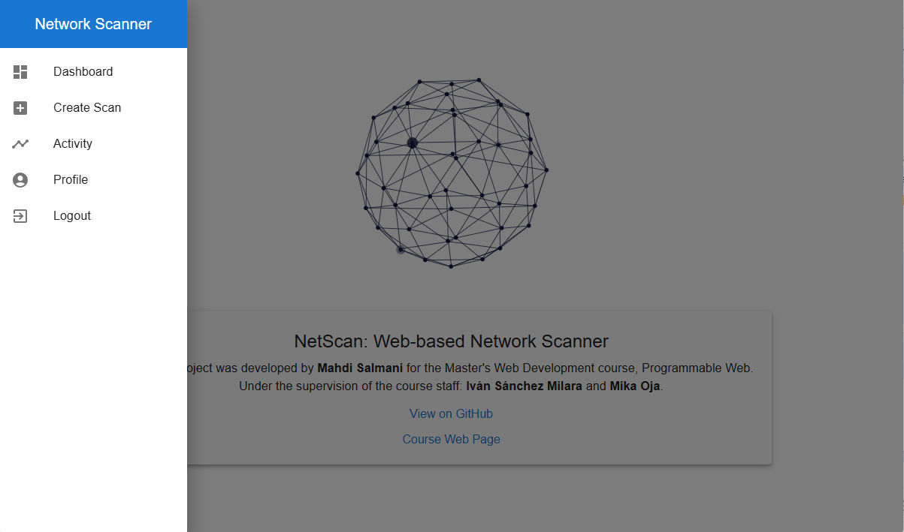

# Project Title: NetScan: Web-based Network Scanner.

# Project Description:

SmartScan is a full-stack web application that allows authenticated users to perform various types of network scans through a user-friendly interface. The application is designed to support IT administrators and security professionals in discovering live hosts, open ports, OS fingerprints, and service versions using the Nmap engine in the backend.

# Technology Stack

| **Category**                | **Technology**                          |
|-----------------------------|-----------------------------------------|
| **Frontend**                | React.js                                |
| **Backend**                 | Django (Django REST Framework)          |
| **Database**                | PostgreSQL                              |
| **Network Scanning Tool**   | Nmap                                    |
| **Visualization**           | Chart.js / ApexCharts (for dashboard)   |
| **Web server**           | Nginx   |

# RESTful API Design

The application exposes a RESTful API with the following core endpoints:

#### Authentication
Method | Endpoint | Description
-- | -- | --
POST | /api/v1/accounts/register/ | Register a new user
POST | /api/v1/accounts/logout/ | Logout the current user
GET | /api/v1/accounts/activity/ | Get list of user actions
GET | /api/v1/accounts/profile/{id}/ | View profile of user with ID
PUT | /api/v1/accounts/profile/{id}/ | Fully update user profile
PATCH | /api/v1/accounts/profile/{id}/ | Partially update user profile
DELETE | /api/v1/accounts/profile/{id}/ | Delete the user account
PUT | /api/v1/accounts/change-password/ | Fully change password
PATCH | /api/v1/accounts/change-password/ | Partial password change

#### Scan Management
Method | Endpoint | Description
-- | -- | --
GET | /api/v1/scans/ | List all scans of current user
POST | /api/v1/scans/ | Create a new scan
GET | /api/v1/scans/{id}/ | Retrieve scan details
PUT | /api/v1/scans/{id}/ | Fully update a scan configuration
PATCH | /api/v1/scans/{id}/ | Partially update a scan
DELETE | /api/v1/scans/{id}/ | Delete scan
POST | /api/v1/scans/{id}/run/ | Run the scan (execute Nmap)
POST | /api/v1/scans/{id}/cancel/ | Cancel an ongoing scan
GET | /api/v1/scans/dashboard/summary/ | Get scan statistics summary

### Database Design

#### User Table
- `id`
- `username`
- `first_name`
- `last_name`
- `password`

#### Scan Table
- `id`
- `user_id` (Foreign Key)
- `name`
- `description`
- `target`
- `type`
- `status`
- `created_at`
- `updated_at`
- `result_file`
- `progress`

---

### Scan Types (Defined by the user)

| Scan Type                         | Command                                      |
|----------------------------------|----------------------------------------------|
| **Host Discovery**               | `nmap <target> -sn -oX result.xml`           |
| **Open Port Scan**               | `nmap <target> --open -oX result.xml`        |
| **OS, Services & Version Detection** | `nmap <target> -A -oX result.xml`       |

### User Roles

All users are authenticated. Roles are limited to the following:

#### Registered User

- Create/edit/delete scans  
- Run scans  
- View detailed results  
- Access dashboard visualizations

### Planned Features

-  User registration and login  
-  Form to define and submit a scan  
-  Execution of selected scan types using Nmap  
-  View and manage scan history  
-  View scan details with parsed structured results  
-  Interactive dashboard for visualization  
-  Download scan reports

# Deployment Plan
Both the backend and frontend will be installed using a Bash script instead of containerization. The PostgreSQL database will be configured manually during setup.
